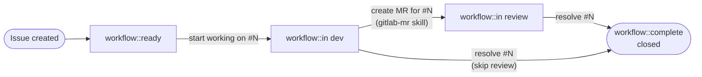
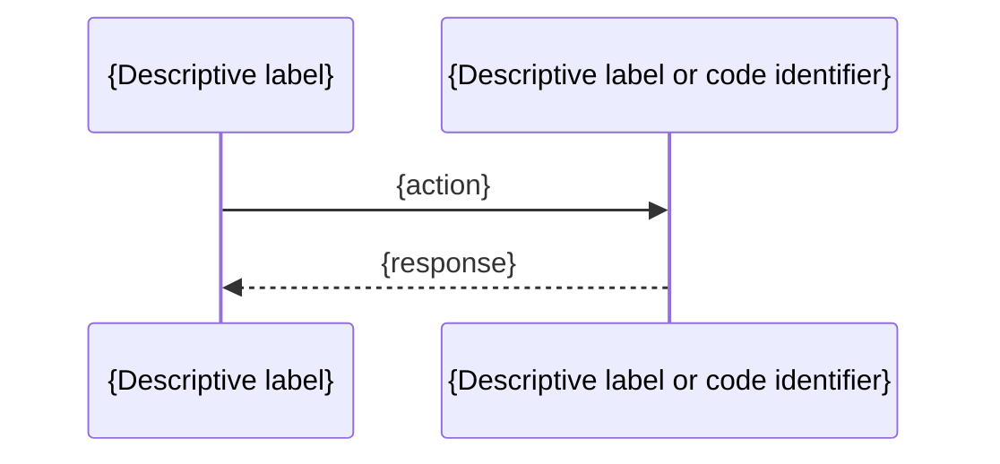
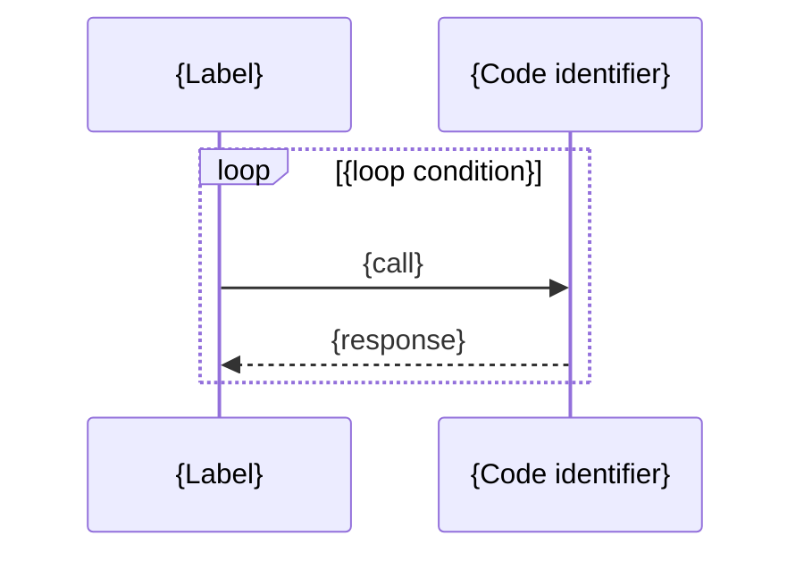

# gitlab-issue v2 Implementation Plan

> **For agentic workers:** REQUIRED SUB-SKILL: Use superpowers:subagent-driven-development (recommended) or superpowers:executing-plans to implement this plan task-by-task. Steps use checkbox (`- [ ]`) syntax for tracking.

**Goal:** Bring the `gitlab-issue` sub-skill fully in line with CLAUDE.md standards and add PM-grade lifecycle capabilities.

**Architecture:** Rewrite `gitlab-issue/SKILL.md` with compliant frontmatter and English body; add two new reference files (`issue-lifecycle.md`, `glab-issue-commands.md`) for on-demand depth; clean all four templates by removing HTML comment blocks and replacing Italian headings with language-neutral `{Placeholder}` markers; update root `SKILL.md` frontmatter.

**Tech Stack:** Markdown only — no compilation step. Verification via `grep`, `wc`, and `git diff`.

---

## File map

| File                                             | Action                                                   |
| ------------------------------------------------ | -------------------------------------------------------- |
| `SKILL.md` (root)                                | Modify — frontmatter + English description               |
| `gitlab-issue/SKILL.md`                          | Full rewrite                                             |
| `gitlab-issue/references/issue-lifecycle.md`     | Create (new)                                             |
| `gitlab-issue/references/glab-issue-commands.md` | Create (new)                                             |
| `gitlab-issue/templates/bug.md`                  | Modify — remove HTML comments, language-neutral headings |
| `gitlab-issue/templates/feature.md`              | Modify — same                                            |
| `gitlab-issue/templates/technical-debt.md`       | Modify — same                                            |
| `gitlab-issue/templates/documentation.md`        | Modify — same                                            |

---

### Task 1: Root SKILL.md — frontmatter compliance

**Files:**

- Modify: `SKILL.md` (root)

- [ ] **Step 1: Replace the frontmatter**

Replace the existing frontmatter block (lines 1–4 of the current file) with the compliant version:

```yaml
---
name: gitlab-author-skills
description:
  "GitLab artifact author. Use when the user asks to create or publish
  an issue, milestone, or merge request on GitLab via glab. Routes to the correct
  sub-skill: gitlab-issue for issues, gitlab-milestone for milestones,
  gitlab-mr for merge requests."
user-invocable: false
license: MIT
compatibility: "Designed for Claude Code or similar AI coding agents. Requires glab CLI authenticated."
metadata:
  author: codeskine
  version: "2.0.0"
allowed-tools: Read Edit Write Glob Grep Bash(git:*) Bash(glab:*) Agent AskUserQuestion
---
```

Also update the sub-skill table description to English and remove the "Stile canonico trasversale" section (it duplicates CLAUDE.md invariants). Replace it with a brief cross-reference:

Replace everything after the `## Sub-skill disponibili` section with:

```markdown
## Available sub-skills

| Sub-skill                                | Purpose                                                              | Status    |
| ---------------------------------------- | -------------------------------------------------------------------- | --------- |
| [`gitlab-issue`](./gitlab-issue)         | Bug reports, feature requests, technical debt, documentation issues. | Available |
| [`gitlab-milestone`](./gitlab-milestone) | Milestone with scope, deliverables and target dates.                 | Available |
| [`gitlab-mr`](./gitlab-mr)               | Merge request descriptions with issue references and diff summary.   | Available |

Cross-cutting conventions (draft gate, snippet policy, language-agnostic templates, no duplication) are defined in [CLAUDE.md](../CLAUDE.md).
```

- [ ] **Step 2: Verify**

```bash
grep "^name:\|^description:\|^license:\|^user-invocable:\|^allowed-tools:\|^compatibility:\|^  author:\|^  version:" SKILL.md
```

Expected: all 8 fields present.

```bash
grep "Use when" SKILL.md
```

Expected: trigger clause found.

- [ ] **Step 3: Commit**

```bash
git add SKILL.md
git commit -m "docs(skill): update root SKILL.md frontmatter to CLAUDE.md standard"
```

---

### Task 2: gitlab-issue/SKILL.md — full rewrite

**Files:**

- Modify: `gitlab-issue/SKILL.md`

- [ ] **Step 1: Write the new SKILL.md**

Replace the entire file content with:

````markdown
---
name: gitlab-issue
description: "GitLab issue author. Use when the user asks to open a bug report,
  feature request, technical debt item, or documentation issue on GitLab via glab.
  Apply when the user says 'create an issue', 'report a bug', 'track tech debt',
  or 'propose a feature'. Not for merge requests (→ See codeskine/gitlab-author-skills@gitlab-mr)
  or milestones (→ See codeskine/gitlab-author-skills@gitlab-milestone)."
user-invocable: true
license: MIT
compatibility: "Designed for Claude Code or similar AI coding agents. Requires glab CLI authenticated."
metadata:
  author: codeskine
  version: "2.0.0"
allowed-tools: Read Edit Write Glob Grep Bash(git:*) Bash(glab:*) Agent AskUserQuestion
---

# GitLab issue author

**Modes:**

- **Create** — generate a new issue from context and publish via `glab issue create`
- **Transition** — change the lifecycle state of an existing issue via `glab issue edit`

## Supported types

| Type             | Template                                                   | Default label          |
| ---------------- | ---------------------------------------------------------- | ---------------------- |
| `bug`            | [templates/bug.md](templates/bug.md)                       | `type::bug`            |
| `feature`        | [templates/feature.md](templates/feature.md)               | `type::feature`        |
| `technical-debt` | [templates/technical-debt.md](templates/technical-debt.md) | `type::technical-debt` |
| `documentation`  | [templates/documentation.md](templates/documentation.md)   | `type::documentation`  |

Default labels are starting points. Override with `--label` when the project uses different scoped labels.

## Create workflow

### 1. Identify the issue type

The user must specify the type in the prompt (e.g. _"create a bug issue for..."_, _"open a technical debt on..."_). If missing, ask once:

> "What type of issue do you want to open? bug / feature / technical-debt / documentation"

### 2. Load the template

Read only `templates/<type>.md` for the chosen type.

### 3. Explore context

**Automatic git extraction** (silent):

```bash
git log --oneline -20        # recent work area
git diff HEAD                # files and symbols involved
```
````

For `bug` or `technical-debt`, also run:

```bash
git blame <file> -L <start>,<end>   # author and date of affected lines
```

**Codebase exploration:** Use `Read`, `Grep`, `Glob` to open identified files, resolve symbolic references (function name, struct, package → `file:line`), and find relevant callers when useful for diagrams.

**Snippet policy:** Include fenced code blocks of 5–20 lines per significant point, with exact `path/file.ext` line N citation. Use language-appropriate syntax highlighting.

Context gathering is silent — no intermediate output. Everything converges in the draft.

### 4. Discover labels and milestone

```bash
glab label list              # discover real project labels before suggesting
glab milestone list --state active
```

Select the most relevant active milestone based on branch name, label, or issue type. If none fits, leave empty. Suggest `workflow::ready` as the initial lifecycle label alongside the type label.

### 5. Apply diagram policy

| Issue type       | Default diagram   | When to include                                                  |
| ---------------- | ----------------- | ---------------------------------------------------------------- |
| `bug`            | `sequenceDiagram` | If the issue involves ≥2 actors / goroutines / components        |
| `technical-debt` | `sequenceDiagram` | If it describes a call chain or problematic flow                 |
| `feature`        | `flowchart` (opt) | Only if the proposal already has a defined flow (convergent MVC) |
| `documentation`  | None              | Never by default                                                 |

Reusable mermaid patterns: [references/mermaid-diagrams.md](references/mermaid-diagrams.md)

### 6. Draft gate

**Do not publish yet.** Present the complete draft in chat with all template sections filled in. Include the proposed title and labels.

Wait for explicit confirmation:

> "Draft ready. Shall I create the issue on GitLab with title '<title>', labels `<labels>`, milestone `<milestone|none>`? (yes / changes / cancel)"

If the user requests changes, apply them and re-present the draft. Repeat until approved.

### 7. Publish via glab

After explicit approval:

1. Write the approved draft to a temp file: `/tmp/issue-<type>-<slug>.md` (slug = first 5–7 tokens of the title, kebab-case)
2. Run:

```bash
glab issue create \
  --title "<title>" \
  --label "<type-label>,workflow::ready" \
  --milestone "<milestone>" \
  --description "$(cat /tmp/issue-<type>-<slug>.md)"
```

Optional flags (use when the user specifies):

```bash
  --assignee "<username>"      # discover members first: glab member list
  --confidential               # for sensitive issues
  --repo "<group/project>"     # cross-project creation
```

Anti-patterns:

- Do **not** use `--body` (that is a `gh` flag, not `glab`). Use `--description`.
- For descriptions with backticks or `$`, use `$(cat /tmp/file.md)` or heredoc with single-quoted delimiter `<< 'EOF'`.
- Use `glab issue note` to comment, **not** `glab issue comment`.

3. Return the created issue URL.

**Post-creation:** If the user mentioned related issues, link them:

```bash
glab issue link <new-issue-id> --target-id <related-id>
```

→ Full flag reference: [references/glab-issue-commands.md](references/glab-issue-commands.md)

## Transition workflow

Use when the user says "start working on #N", "lavora la issue #N", "resolve #N", or similar lifecycle phrases.

1. Read current issue state:
   ```bash
   glab issue view <N> --output json
   ```
2. Determine the current `workflow::` label.
3. Look up the valid transition in [references/issue-lifecycle.md](references/issue-lifecycle.md).
4. Warn if the requested transition is invalid (e.g. issue is already `workflow::in dev`).
5. Apply the transition:
   ```bash
   glab issue edit <N> --label "<new-state>" --unlabel "<current-state>"
   ```
6. Confirm the transition in chat.

Full state machine: [references/issue-lifecycle.md](references/issue-lifecycle.md)

## References

- Mermaid patterns: [references/mermaid-diagrams.md](references/mermaid-diagrams.md)
- Issue lifecycle: [references/issue-lifecycle.md](references/issue-lifecycle.md)
- Full glab flag reference: [references/glab-issue-commands.md](references/glab-issue-commands.md)
- Templates: [templates/bug.md](templates/bug.md), [templates/feature.md](templates/feature.md), [templates/technical-debt.md](templates/technical-debt.md), [templates/documentation.md](templates/documentation.md)

````

- [ ] **Step 2: Verify frontmatter fields**

```bash
grep "^name:\|^description:\|^license:\|^user-invocable:\|^allowed-tools:\|^compatibility:\|^  author:\|^  version:" gitlab-issue/SKILL.md
````

Expected: all 8 fields present.

- [ ] **Step 3: Verify body quality**

```bash
grep "Use when" gitlab-issue/SKILL.md
grep "GitLab" gitlab-issue/SKILL.md
grep "Transition workflow" gitlab-issue/SKILL.md
grep "workflow::ready" gitlab-issue/SKILL.md
```

All four expected to match.

```bash
grep "italiano\|italiano\|Isolamento\|Stile canonico" gitlab-issue/SKILL.md
```

Expected: no output (no Italian text, no old directives).

- [ ] **Step 4: Commit**

```bash
git add gitlab-issue/SKILL.md
git commit -m "docs(skill): rewrite gitlab-issue SKILL.md — CLAUDE.md compliance + lifecycle + PM workflow"
```

---

### Task 3: Create references/issue-lifecycle.md

**Files:**

- Create: `gitlab-issue/references/issue-lifecycle.md`

- [ ] **Step 1: Write the file**

````markdown
# Issue Lifecycle

## State machine


````

## YAML state machine (agent-parseable)

```yaml
workflow:
  states:
    - label: "workflow::ready"
      triggers:
        - "start working on #N"
        - "lavora la issue #N"
        - "pick up #N"
      transitions_to: "workflow::in dev"
      glab: "glab issue edit N --label 'workflow::in dev' --unlabel 'workflow::ready'"
    - label: "workflow::in dev"
      triggers:
        - "create MR for #N"
        - "crea una MR per la issue #N"
      transitions_to: "workflow::in review"
      glab: "handled by gitlab-mr skill"
    - label: "workflow::in review"
      triggers:
        - "resolve #N"
        - "risolvi #N"
        - "close #N"
        - "chiudi #N"
      transitions_to: "workflow::complete"
      glab: "glab issue edit N --label 'workflow::complete' --unlabel 'workflow::in review' && glab issue close N"
    - label: "workflow::in dev"
      triggers:
        - "resolve #N (skip review)"
        - "chiudi direttamente #N"
      transitions_to: "workflow::complete"
      glab: "glab issue edit N --label 'workflow::complete' --unlabel 'workflow::in dev' && glab issue close N"
```

## Transition table

| User says                                    | From state            | To state                     | glab command                                                                                           |
| -------------------------------------------- | --------------------- | ---------------------------- | ------------------------------------------------------------------------------------------------------ |
| "create an issue"                            | —                     | `workflow::ready`            | Applied at creation alongside `type::*`                                                                |
| "start working on #N" / "lavora la issue #N" | `workflow::ready`     | `workflow::in dev`           | `glab issue edit N --label 'workflow::in dev' --unlabel 'workflow::ready'`                             |
| "create MR for #N"                           | `workflow::in dev`    | `workflow::in review`        | Handled by `gitlab-mr` skill                                                                           |
| "resolve #N" / "risolvi #N"                  | `workflow::in review` | `workflow::complete` + close | `glab issue edit N --label 'workflow::complete' --unlabel 'workflow::in review' && glab issue close N` |
| "resolve #N" (skip review)                   | `workflow::in dev`    | `workflow::complete` + close | `glab issue edit N --label 'workflow::complete' --unlabel 'workflow::in dev' && glab issue close N`    |
| "close #N" / "chiudi #N"                     | any                   | `workflow::complete` + close | Same as "resolve" for current state                                                                    |

## Issue Board setup

Create the four `workflow::` labels in the project (run once per project):

```bash
glab label create "workflow::ready"     --color "#428BCA" --description "Issue defined, ready to be picked up"
glab label create "workflow::in dev"    --color "#F0AD4E" --description "Actively being worked on"
glab label create "workflow::in review" --color "#5CB85C" --description "MR open, waiting for merge"
glab label create "workflow::complete"  --color "#5BC0DE" --description "Done, issue closed"
```

These four labels map directly to four Issue Board columns (GitLab → Project → Plan → Issue Boards). Scoped labels (`workflow::*`) enforce a single active state per issue.

````

- [ ] **Step 2: Verify**

```bash
test -f gitlab-issue/references/issue-lifecycle.md && echo "file exists"
grep "mermaid" gitlab-issue/references/issue-lifecycle.md
grep "workflow:" gitlab-issue/references/issue-lifecycle.md
grep "glab label create" gitlab-issue/references/issue-lifecycle.md
````

All four expected to match.

- [ ] **Step 3: Commit**

```bash
git add gitlab-issue/references/issue-lifecycle.md
git commit -m "docs(skill): add issue-lifecycle reference — mermaid + YAML state machine"
```

---

### Task 4: Create references/glab-issue-commands.md

**Files:**

- Create: `gitlab-issue/references/glab-issue-commands.md`

- [ ] **Step 1: Write the file**

````markdown
# glab issue — Full Command Reference

## Core create command

```bash
glab issue create \
  --title "<title>" \
  --label "<labels>" \
  --milestone "<milestone>" \
  --description "$(cat /tmp/issue.md)"
```
````

## Complete flag table — `glab issue create`

| Flag                 | Value                                       | When to use                                                              |
| -------------------- | ------------------------------------------- | ------------------------------------------------------------------------ |
| `--title`            | string                                      | Required. Issue title.                                                   |
| `--label`            | comma-separated                             | Labels to apply. Comma-separate multiple: `"type::bug,workflow::ready"`. |
| `--milestone`        | string                                      | Milestone title or ID.                                                   |
| `--description`      | string or `$(cat file)`                     | Issue body. Prefer `$(cat /tmp/file.md)` for multi-line content.         |
| `--assignee`         | username                                    | Assign to a project member. Discover members first (see below).          |
| `--confidential`     | flag (no value)                             | Mark issue as confidential (visible only to project members).            |
| `--weight`           | integer                                     | Issue weight (1–10 or project-defined range).                            |
| `--due-date`         | YYYY-MM-DD                                  | Due date for the issue.                                                  |
| `--related-issue-id` | integer                                     | Link to a related issue at creation time.                                |
| `--link-type`        | `relates_to` \| `blocks` \| `is_blocked_by` | Type of relationship link (default: `relates_to`).                       |
| `--repo`             | group/project                               | Cross-project creation. Requires authentication for the target project.  |

## Discovery commands

Run before suggesting labels, assignees, or milestones:

```bash
# Discover project labels
glab label list

# Discover project members (for --assignee)
glab member list

# List open issues (for context or linking)
glab issue list --state opened
```

## Post-creation commands

```bash
# Link to a related issue after creation
glab issue link <issue-id> --target-id <related-id>
glab issue link <issue-id> --target-id <related-id> --link-type blocks

# Add a comment/note to an issue
glab issue note <issue-id> --message "<comment>"

# Edit labels or lifecycle state
glab issue edit <issue-id> --label "<new-label>" --unlabel "<old-label>"

# Close an issue
glab issue close <issue-id>
```

## Anti-patterns

| Wrong                             | Correct                                | Why                                                               |
| --------------------------------- | -------------------------------------- | ----------------------------------------------------------------- |
| `--body "..."`                    | `--description "..."`                  | `--body` is a GitHub CLI (`gh`) flag; `glab` uses `--description` |
| Inline description with backticks | `--description "$(cat /tmp/file.md)"`  | Shell expansion breaks on backticks and unquoted `$`              |
| `glab issue comment <id>`         | `glab issue note <id> --message "..."` | `comment` is not a valid `glab issue` subcommand                  |
| `--description "multi\nline"`     | Write to file, use `$(cat file)`       | Shell quoting fails on embedded newlines                          |

## Heredoc pattern

Use when the description contains backticks, `$` variables, or multi-line content:

```bash
cat << 'EOF' > /tmp/issue-bug-slug.md
## {Description}

Content with `backticks` and $variables is safe inside a single-quoted heredoc.
EOF

glab issue create \
  --title "Fix the thing" \
  --label "type::bug,workflow::ready" \
  --description "$(cat /tmp/issue-bug-slug.md)"
```

````

- [ ] **Step 2: Verify**

```bash
test -f gitlab-issue/references/glab-issue-commands.md && echo "file exists"
grep "\-\-assignee\|\-\-confidential\|\-\-weight\|\-\-due-date\|\-\-repo" gitlab-issue/references/glab-issue-commands.md
grep "Anti-patterns" gitlab-issue/references/glab-issue-commands.md
grep "glab label list\|glab member list" gitlab-issue/references/glab-issue-commands.md
````

All expected to match.

- [ ] **Step 3: Commit**

```bash
git add gitlab-issue/references/glab-issue-commands.md
git commit -m "docs(skill): add glab-issue-commands reference — full flag inventory and anti-patterns"
```

---

### Task 5: Clean templates/bug.md

**Files:**

- Modify: `gitlab-issue/templates/bug.md`

- [ ] **Step 1: Replace entire file content**

Remove all `<!-- ... -->` blocks and replace Italian headings with language-neutral `{Placeholder}` markers. Keep structure: subsections, code block shape, mermaid shape, checklist.

````markdown
## {Description}

### 1. {Subsection title}

```<lang>
// path/to/file.ext line N
{relevant code}
```
````



### 2. {Optional subsection}

---

## {Impact}

---

## {Related issues}

- {point 1}
- {point 2}

---

## {Files affected}

- `path/to/file1.ext`
- `path/to/file2.ext`

---

## {Activities}

- [ ] {action 1}
- [ ] {action 2}
- [ ] {Add / update unit tests}

````

- [ ] **Step 2: Verify — no Italian, no HTML comments**

```bash
grep "<!--" gitlab-issue/templates/bug.md
````

Expected: no output.

```bash
grep "Descrizione\|Impatto\|coinvolti\|Attivita'\|Criticita'" gitlab-issue/templates/bug.md
```

Expected: no output.

- [ ] **Step 3: Commit**

```bash
git add gitlab-issue/templates/bug.md
git commit -m "docs(template): clean bug.md — remove HTML comments, language-neutral headings"
```

---

### Task 6: Clean templates/feature.md

**Files:**

- Modify: `gitlab-issue/templates/feature.md`

- [ ] **Step 1: Replace entire file content**

```markdown
## {Summary}

---

## {Problem to solve}

---

## {Proposal}

---

## {Areas to explore}

**{Area 1}**

- {exploration 1}
- {exploration 2}

**{Area 2}**

- {exploration 1}
- {exploration 2}

**{Area 3}**

- {exploration 1}
- {exploration 2}

---

## {MVC (Minimum Viable Change)}

- {MVC item 1}
- {MVC item 2}
- {MVC item 3}
- {Define instrumentation to measure success}

---

## {Goals}

A user with {profile / context} should be able to:

- {goal 1}
- {goal 2}
- {goal 3}

---

## {Acceptance criteria}

- [ ] {criterion 1}
- [ ] {criterion 2}
- [ ] {criterion 3}
- [ ] {Create follow-up issues for agreed implementation}

---

## {Open questions}

- {question 1}?
- {question 2}?
- {question 3}?

---

## {Next steps}

- {step 1}
- {step 2}
- {step 3}
- {step 4}
```

- [ ] **Step 2: Verify — no Italian, no HTML comments**

```bash
grep "<!--" gitlab-issue/templates/feature.md
```

Expected: no output.

```bash
grep "Sommario\|Problema\|Proposta\|Aree\|Obiettivi\|Domande\|Prossimi" gitlab-issue/templates/feature.md
```

Expected: no output.

- [ ] **Step 3: Commit**

```bash
git add gitlab-issue/templates/feature.md
git commit -m "docs(template): clean feature.md — remove HTML comments, language-neutral headings"
```

---

### Task 7: Clean templates/technical-debt.md

**Files:**

- Modify: `gitlab-issue/templates/technical-debt.md`

- [ ] **Step 1: Replace entire file content**

````markdown
## {Description}

### {Section 1: Methods involved}

**`{MethodName}`** — `path/to/file.ext` line N:

```<lang>
// current code
{relevant code}
```
````

### {Section 2: Current call chain} (optional)



---

## {Impact}

---

## {Notes on <topic>} (optional)

---

## {Files affected}

- `path/to/file1.ext`
- `path/to/file2.ext` — {brief note if relevant}

---

## {Activities}

- [ ] {refactor action 1}
- [ ] {Maintain compatibility with interface X}
- [ ] {Add unit tests to verify new behavior}

````

- [ ] **Step 2: Verify — no Italian, no HTML comments**

```bash
grep "<!--" gitlab-issue/templates/technical-debt.md
````

Expected: no output.

```bash
grep "Descrizione\|Impatto\|coinvolti\|Attivita'\|Catena" gitlab-issue/templates/technical-debt.md
```

Expected: no output.

- [ ] **Step 3: Commit**

```bash
git add gitlab-issue/templates/technical-debt.md
git commit -m "docs(template): clean technical-debt.md — remove HTML comments, language-neutral headings"
```

---

### Task 8: Clean templates/documentation.md

**Files:**

- Modify: `gitlab-issue/templates/documentation.md`

- [ ] **Step 1: Replace entire file content**

```markdown
## {Summary}

{Add documentation for <feature / change / component>, introduced by:}

- !{N1} ({status}) — {brief description of MR content}
- !{N2} ({status}) — {brief description of MR content}
- !{N3} ({status}) — {brief description of MR content}

---

## {What to document}

{Add / modify the <section name> section in `doc/<path>/<file>.md`, describing:}

- {key point 1}
- {key point 2}
- {key point 3}

---

## {Documentation requirements}

- [ ] {Follow standard template <name>}
- [ ] {Explain <what>}
- [ ] {Provide commands for <target audience>}
- [ ] {State the default value and feature flag status}
- [ ] {Additional requirement specific to this change}

---

## {Related references}

- {Related issue}: #{N} ({status})
- {Related MR}: !{N} ({status})
- {Cross-project}: `group/project#{N}` ({status})
```

- [ ] **Step 2: Verify — no Italian, no HTML comments**

```bash
grep "<!--" gitlab-issue/templates/documentation.md
```

Expected: no output.

```bash
grep "Sommario\|documentare\|Requisiti\|Riferimenti correlati" gitlab-issue/templates/documentation.md
```

Expected: no output.

- [ ] **Step 3: Commit**

```bash
git add gitlab-issue/templates/documentation.md
git commit -m "docs(template): clean documentation.md — remove HTML comments, language-neutral headings"
```

---

### Task 9: Final verification

**Files:** All modified/created files.

- [ ] **Step 1: Verify all frontmatter fields in gitlab-issue/SKILL.md**

```bash
grep "^name:\|^description:\|^license:\|^user-invocable:\|^allowed-tools:\|^compatibility:\|^  author:\|^  version:" gitlab-issue/SKILL.md
```

Expected: 8 lines.

- [ ] **Step 2: Verify description quality**

```bash
grep "GitLab" gitlab-issue/SKILL.md
grep "Use when\|Apply when" gitlab-issue/SKILL.md
grep "→ See" gitlab-issue/SKILL.md
```

All three expected to match.

- [ ] **Step 3: Verify no HTML comments in any template**

```bash
grep "<!--" gitlab-issue/templates/*.md
```

Expected: no output.

- [ ] **Step 4: Verify no hardcoded Italian headings in templates**

```bash
grep "^## Descrizione\|^## Impatto\|^## Attivita'\|^## Sommario\|^## Proposta\|^## Requisiti\|^## Riferimenti correlati" gitlab-issue/templates/*.md
```

Expected: no output.

- [ ] **Step 5: Verify new reference files exist**

```bash
test -f gitlab-issue/references/issue-lifecycle.md && echo "lifecycle ok"
test -f gitlab-issue/references/glab-issue-commands.md && echo "commands ok"
```

Expected: both lines printed.

- [ ] **Step 6: Check line count of gitlab-issue/SKILL.md (should be under 500)**

```bash
wc -l gitlab-issue/SKILL.md
```

Expected: under 500 lines.

- [ ] **Step 7: Git log to confirm all commits landed**

```bash
git log --oneline -10
```

Expected: all 8 commits from tasks 1–8 visible.
