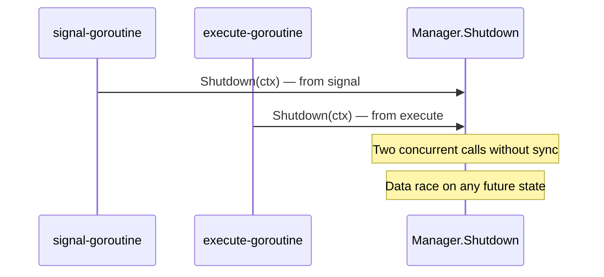

## Description

### 1. `Shutdown` called from two goroutines without protection

`scraperManager.Shutdown` can be invoked concurrently from both the signal goroutine (line 76)
and the execute goroutine (line 93):

```go
// main.go line 76-78 — signal goroutine
if err := scraperManager.Shutdown(ctx); err != nil {
    log.Error().Err(err).Msg("Main: scraper shutdown failed")
}

// main.go line 93-95 — execute goroutine
if err := scraperManager.Shutdown(ctx); err != nil {
    log.Error().Err(err).Msg("Main: scraper shutdown failed")
}
```

The current `Shutdown` implementation is a no-op:

```go
// app/scraper/scraperController.go line 104-107
func (sc *Manager) Shutdown(ctx context.Context) error {
    log.Debug().Msgf("ScraperManager::Shutdown shutdown scraper controller")
    return nil
}
```

Any future change to `Shutdown` that reads or mutates internal `Manager` state will introduce a
data race detectable by `go test -race`.

### 2. Concurrent Shutdown calls



---

## Steps to reproduce

1. Add any mutable field touched by `Manager.Shutdown`.
2. Run `go test -race ./...` with a test that simulates SIGTERM during Execute.
3. The race detector reports the data race.

---

## Expected behavior

Concurrent calls to `Shutdown` are safe: the shutdown logic runs at most once thanks to
`sync.Once`.

---

## Actual behavior

Two concurrent `Shutdown` calls access shared `Manager` state without synchronization.

---

## Impact

Any future evolution of `Shutdown` that writes to `Manager` fields introduces a data race that is
not immediately visible. The `Shutdown` contract does not guarantee concurrent idempotency.

---

## Related issues

- Epic: [#39 — CONC Concurrency Safety](https://gitlab.example.com/acme/platform-scraper/-/issues/39)
- Related to CONC-001, CONC-002

---

## Affected files

- `main.go` — lines 76–78, 93–95
- `app/scraper/scraperController.go` — lines 104–107

---

## Tasks

- [ ] Add a `shutdownOnce sync.Once` field to `Manager`
- [ ] Wrap the `Shutdown` logic with `sc.shutdownOnce.Do(func() { ... })`
- [ ] `go test -race ./...` with no shutdown-related data-race report
- [ ] `golangci-lint run` with no additional errors
