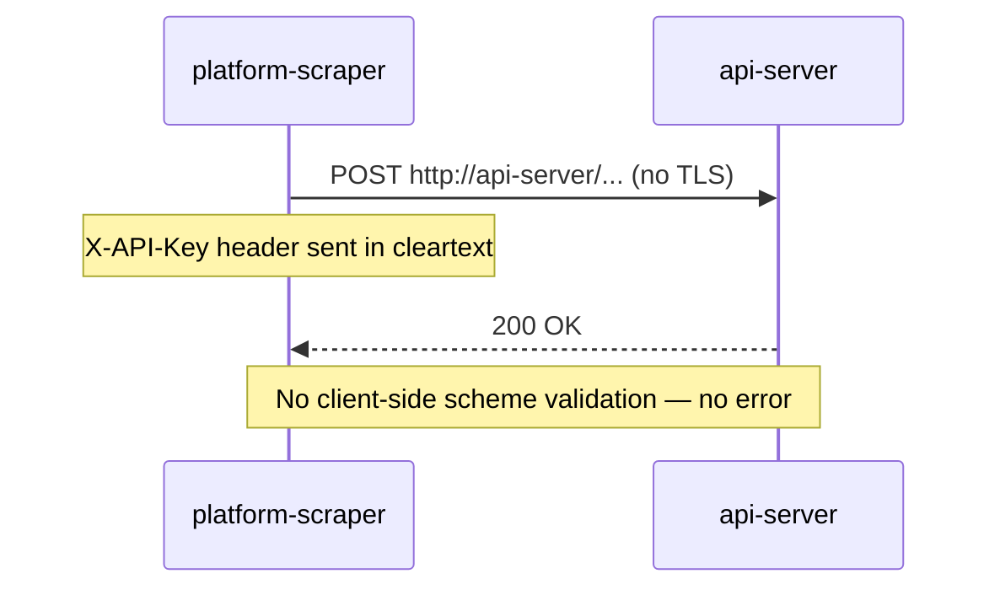

## Description

### 1. HTTP transport with no explicit tls.Config

`getClient()` wraps `http.DefaultTransport` without configuring a `tls.Config`:

```go
// app/utils/httputils.go line 176-185
func getClient(timeout time.Duration) *http.Client {
    return &http.Client{
        Transport: otelhttp.NewTransport(http.DefaultTransport,
            otelhttp.WithFilter(func(r *http.Request) bool {
                return r.URL.Path != "/ping"
            }),
        ),
        Timeout: timeout,
    }
}
```

If `cfg.APIServer.Endpoint` uses the `http://` scheme, every POST and DELETE request — including
the `X-API-Key` header — travels in cleartext. The client neither validates the scheme nor emits
a startup error.

### 2. Connection flow with no TLS enforcement



---

## Steps to reproduce

1. Configure `API_SERVER_ENDPOINT=http://...` (the `http://` scheme).
2. Start `platform-scraper`.
3. Observe: the scraper starts and sends requests in cleartext with no error.

---

## Expected behavior

- Startup fails with an explicit error if `cfg.APIServer.Endpoint` uses the `http://` scheme.
- The HTTP transport enforces `tls.VersionTLS12` as the minimum Transport Layer Security (TLS) version.

---

## Actual behavior

The scraper accepts `http://` endpoints without error and sends requests in cleartext, unencrypted.

---

## Impact

The `X-API-Key` and the Kubernetes payloads travel in cleartext over unencrypted networks. An
attacker with network access can intercept the key and replay write and delete operations against
the API server.

DREAD: Damage 7, Reproducibility 6, Exploitability 6, Affected users 4, Discoverability 6 →
**Score: 5.8 (Medium)**.

---

## Related issues

- Epic: [#69 — SEC Security Hardening](https://gitlab.example.com/acme/platform-scraper/-/issues/69)
- Related to SEC-001: both concern protecting the `X-API-Key` header
- Blocking for PERF-001 and PERF-002: the shared transport must include the `tls.Config`

---

## Affected files

- `app/utils/httputils.go` — lines 176–185, function `getClient`
- `app/config/model.go` — field `APIServerConfiguration.Endpoint`

---

## Tasks

- [ ] Add `tls.Config{MinVersion: tls.VersionTLS12}` to the `http.Transport` used in `getClient`
- [ ] Add startup validation: if `cfg.APIServer.Endpoint` uses the `http://` scheme, log an error and call `os.Exit(1)`
- [ ] `go build ./...` with no errors
- [ ] `golangci-lint run` with no additional errors
