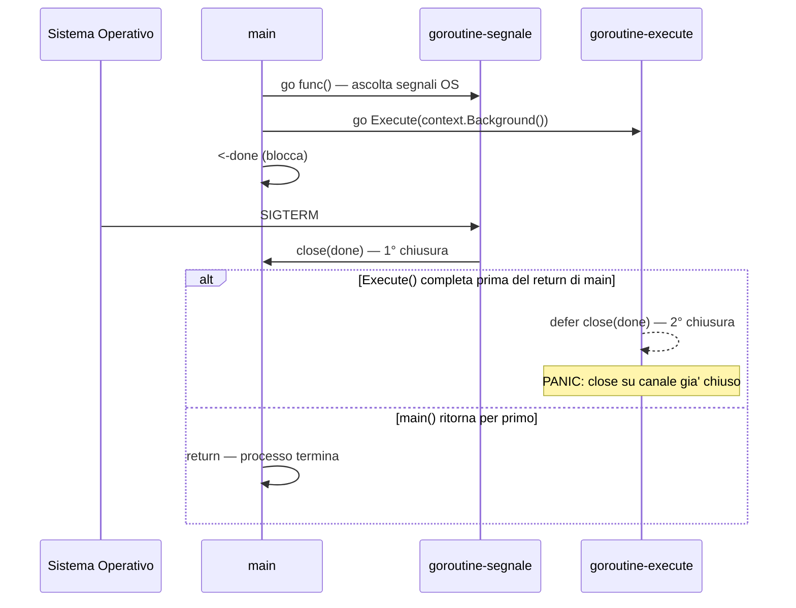
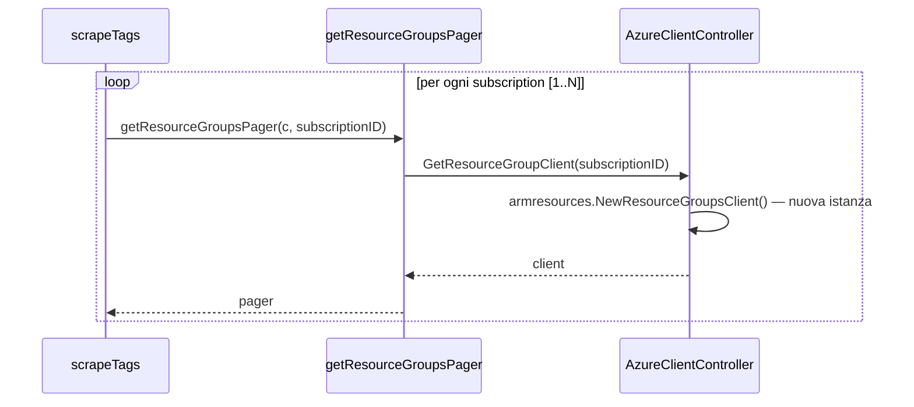
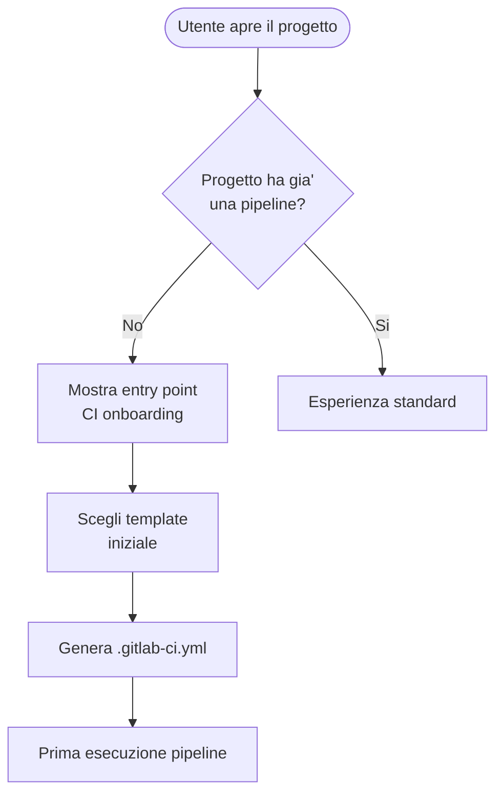

# Pattern Mermaid per le issue GitLab

Riferimento per i diagrammi mermaid da includere nelle issue. Carica solo quando devi generare un diagramma.

## Policy di applicazione

| Tipo issue        | Pattern              | Quando includere                                                 |
|-------------------|----------------------|------------------------------------------------------------------|
| `bug`             | `sequenceDiagram`    | La issue coinvolge >=2 attori (goroutine, processi, servizi)     |
| `technical-debt`  | `sequenceDiagram`    | La issue descrive una catena di chiamata o un flusso problematico|
| `feature`         | `flowchart`          | Solo se la proposta ha gia' un flusso definito (MVC convergente) |
| `documentation`   | Nessuno              | Mai                                                              |

## Regole di localizzazione

- **Etichette descrittive** (ruoli, sistemi, concetti): **italiano**
  - Esempi: `Sistema Operativo`, `goroutine-segnale`, `Database`, `Client API`, `Coda messaggi`
- **Identificatori di codice** (nomi di funzione, struct, package, metodi): **inglese / nome originale**
  - Esempi: `scrapeTags`, `AzureClientController`, `GetResourceGraphClient`, `main`

## Sintassi mermaid sicura

- NON usare spazi nei nomi/ID dei nodi e dei partecipanti. Usa camelCase, PascalCase o underscores.
- Quando un'etichetta contiene caratteri speciali (parentesi, due punti, virgole), usa virgolette doppie.
- Non usare keyword riservate come ID di nodo: `end`, `subgraph`, `graph`, `flowchart`.

## Pattern 1 — sequenceDiagram per bug multi-attore

Usare quando il bug e' una race condition, una sequenza di eventi problematica, un ordering di operazioni errato.

Elementi chiave:

- `participant <ID> as <Etichetta italiana>` — l'ID e' un identificatore corto, l'etichetta e' leggibile in italiano
- `->>` per chiamata sincrona, `-->>` per ritorno
- `alt / else / end` per rami condizionali con esiti diversi
- `Note over <ID>: <testo>` per annotazioni critiche (panic, comportamento non atteso)
- `loop <condizione> ... end` per cicli (vedi Pattern 2)

## Pattern 2 — sequenceDiagram per technical-debt con ciclo

Usare per debito tecnico legato a ripetizione di operazioni in un loop (allocazioni, chiamate ridondanti, ecc.).

Elementi chiave:

- `loop <descrizione del loop>` — la descrizione e' in italiano, ma puo' includere variabili in inglese (`[1..N]`)
- Le auto-chiamate (`AC->>AC: ...`) sono utili per mostrare allocazioni interne / passi di setup ripetuti

## Pattern 3 — flowchart per feature a MVC convergente

Usare SOLO quando la feature ha gia' un flusso utente definito (non per proposte ancora in discovery).

Elementi chiave:

- `flowchart TD` (top-down) o `LR` (left-right) a seconda della complessita'
- Forme: `([...])` ovale per inizio/fine, `[...]` rettangolo per azione, `{...}` rombo per decisione
- Etichette degli archi con `-->|"<testo>"|` quando contengono spazi o caratteri speciali
- ` ` per andare a capo dentro un'etichetta

## Quando NON aggiungere un diagramma

- Bug isolato su singolo attore / funzione pura → niente diagramma
- Debito tecnico locale (es. nome variabile, refactor di una funzione) → niente diagramma
- Feature discovery / proposta esplorativa → niente diagramma
- Issue di documentazione → MAI un diagramma
