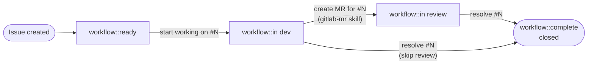

# Issue Lifecycle

## State machine



## YAML state machine (agent-parseable)

```yaml
workflow:
  states:
    - label: "workflow::ready"
      triggers:
        - "start working on #N"
        - "lavora la issue #N"
        - "pick up #N"
      transitions:
        - to: "workflow::in dev"
          glab: "glab issue edit N --label 'workflow::in dev' --unlabel 'workflow::ready'"
    - label: "workflow::in dev"
      transitions:
        - triggers:
            - "create MR for #N"
            - "crea una MR per la issue #N"
          to: "workflow::in review"
          glab: "handled by gitlab-mr skill"
        - triggers:
            - "resolve #N (skip review)"
            - "chiudi direttamente #N"
          to: "workflow::complete"
          glab: "glab issue edit N --label 'workflow::complete' --unlabel 'workflow::in dev' && glab issue close N"
    - label: "workflow::in review"
      transitions:
        - triggers:
            - "resolve #N"
            - "risolvi #N"
            - "close #N"
            - "chiudi #N"
          to: "workflow::complete"
          glab: "glab issue edit N --label 'workflow::complete' --unlabel 'workflow::in review' && glab issue close N"
```

## Transition table

| User says | From state | To state | glab command |
|-----------|------------|----------|--------------|
| "create an issue" | — | `workflow::ready` | Applied at creation alongside `type::*` |
| "start working on #N" / "lavora la issue #N" | `workflow::ready` | `workflow::in dev` | `glab issue edit N --label 'workflow::in dev' --unlabel 'workflow::ready'` |
| "create MR for #N" | `workflow::in dev` | `workflow::in review` | Handled by `gitlab-mr` skill |
| "resolve #N" / "risolvi #N" | `workflow::in review` | `workflow::complete` + close | `glab issue edit N --label 'workflow::complete' --unlabel 'workflow::in review' && glab issue close N` |
| "resolve #N" (skip review) | `workflow::in dev` | `workflow::complete` + close | `glab issue edit N --label 'workflow::complete' --unlabel 'workflow::in dev' && glab issue close N` |
| "close #N" / "chiudi #N" | any | `workflow::complete` + close | Same as "resolve" for current state |

## Issue Board setup

Create the four `workflow::` labels in the project (run once per project):

```bash
glab label create "workflow::ready"     --color "#428BCA" --description "Issue defined, ready to be picked up"
glab label create "workflow::in dev"    --color "#F0AD4E" --description "Actively being worked on"
glab label create "workflow::in review" --color "#5CB85C" --description "MR open, waiting for merge"
glab label create "workflow::complete"  --color "#5BC0DE" --description "Done, issue closed"
```

These four labels map directly to four Issue Board columns (GitLab → Project → Plan → Issue Boards). Scoped labels (`workflow::*`) enforce a single active state per issue.
