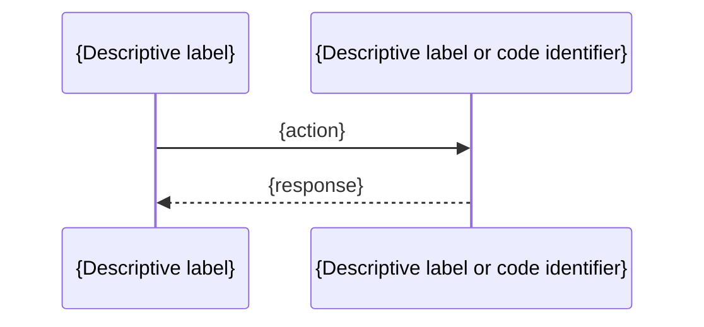

## {Description}

### 1. {Subsection title}

```<lang>
// path/to/file.ext line N
{relevant code}
```



### 2. {Optional subsection}

---

## {Impact}

---

## {Related issues}

- {point 1}
- {point 2}

---

## {Files affected}

- `path/to/file1.ext`
- `path/to/file2.ext`

---

## {Activities}

- [ ] {action 1}
- [ ] {action 2}
- [ ] {Add / update unit tests}
