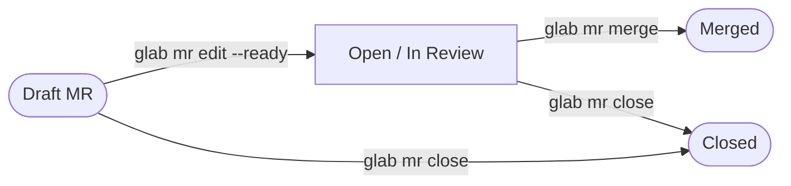

# MR Lifecycle

## State machine



## Linked issue transitions

When the MR is opened (ties to the issue lifecycle in `gitlab-issue` skill):

| MR event              | Issue transition       | glab command                                                                   |
| --------------------- | ---------------------- | ------------------------------------------------------------------------------ |
| MR opened (ready)     | `in dev` → `in review` | `glab issue edit N --label 'workflow::in review' --unlabel 'workflow::in dev'` |
| MR changes requested  | `in review` → `in dev` | `glab issue edit N --label 'workflow::in dev' --unlabel 'workflow::in review'` |
| MR merged             | auto-closed by GitLab  | GitLab closes issues referenced by `Closes #N` on merge; no manual step needed |
| MR closed (abandoned) | → `workflow::ready`    | `glab issue edit N --label 'workflow::ready' --unlabel 'workflow::in review'`  |

## Draft → Ready

Remove Draft status when the branch is ready for review:

```bash
glab mr edit <id> --ready
```

GitLab also accepts removing Draft via the web UI by clicking "Mark as ready."

## MR Board setup

Create the `workflow::` labels in the project (run once per project — shared with the issue board):

```bash
glab label create "workflow::ready"      --color "#428BCA" --description "Issue defined, ready to be picked up"
glab label create "workflow::in dev"     --color "#F0AD4E" --description "Actively being worked on"
glab label create "workflow::in review"  --color "#5CB85C" --description "MR open, waiting for merge"
glab label create "workflow::complete"   --color "#5BC0DE" --description "Done, issue closed"
```

Scoped labels (`workflow::*`) enforce a single active state per issue or MR.

## Cross-skill reference

Issue lifecycle (upstream of MR): [gitlab-issue skill — references/issue-lifecycle.md](../../gitlab-issue/references/issue-lifecycle.md)
